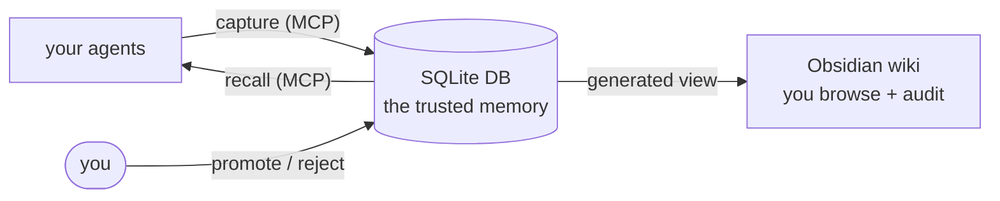

# wiki-brain


<!-- Suggested GitHub topics (set in the repo's About panel): mcp · ai-agents · agent-memory · knowledge-base · obsidian · sqlite · local-first · llm -->

> **A standalone, self-hosted, privacy-first trusted memory ledger.** It runs on its own
> and needs nothing else installed. [AgentConnect](https://github.com/Judgernaut777/mcp-agentconnect)
> is an **optional** control-plane integration for managed coding-agent workflows.

WikiBrain is a trusted memory ledger for agent systems. Agents can propose memory candidates, but trusted claims are human-gated, scoped, provenance-backed, and governed by promotion, rejection, contradiction, and supersession rules. It is designed to act as the authority layer for project memory while leaving task execution, routing, and workflow state to systems like AgentConnect.



Three rules make it trustworthy:

- **Agents can only propose, never decide.** Everything captured — by an agent or
  by you — lands *pending*. It becomes trusted memory only when you promote it.
  That gate is what makes it safe to let agents write to your memory at all.
- **The `wiki` tool never calls a model.** All the plumbing — storing, generating
  the wiki, searching — is plain, deterministic code with zero API calls. Only a
  separate **librarian** process uses a model, and only to read raw sources and
  *draft* candidate facts for you to review.
- **Retrieval can never widen trust.** The search backend only nominates rows by
  id; the ledger itself answers for status, scope and confidence. Swap in a vector
  store or a graph index and the trust boundary does not move.

Every fact traces back to its source, and wiki-brain flags when a new fact
contradicts one you already trust.

### Documentation

| Document | Read it for |
|---|---|
| **[docs/STATUS.md](docs/STATUS.md)** | Where the project stands right now: schema version, gate count, the current freeze, and what may still change |
| **[docs/LEDGER_SPEC.md](docs/LEDGER_SPEC.md)** | The design contract — trust, scopes, profiles, the backend seam, and the [trust rule (§14.1)](docs/LEDGER_SPEC.md) every consumer must obey |
| **[docs/MIGRATIONS.md](docs/MIGRATIONS.md)** | Schema evolution, and the live-DB hazard: `Repo.open()` migrates, and a temp repo root is **not** isolation |
| **[docs/SAFETY.md](docs/SAFETY.md)** | What the trust gate does and does not protect against — and why **trusted is not the same as safe to expose** |
| **BUILD_SPEC.md** | The origin design |
| **SCHEMA.md** | Living conventions: vocabularies and state machines |

> **Hacking on wiki-brain?** Opening a repo runs forward schema migrations
> automatically — on *every* `Repo.open()`, including the one the MCP server
> performs at launch. Passing a temporary repo root does **not** isolate the
> database, which lives at an absolute path from `config.toml`. Set
> **`WIKIBRAIN_DB=/tmp/scratch.db`** in tests, scripts and MCP verification so they
> cannot touch your live `~/.wiki-brain/wiki.db`. See
> **[docs/MIGRATIONS.md](docs/MIGRATIONS.md)**.

---

## The trusted memory ledger

wiki-brain is a **trusted memory ledger** with a **pluggable retrieval backend**:
it owns trust and provenance, while the backend owns search sophistication. The
full contract is in **[docs/LEDGER_SPEC.md](docs/LEDGER_SPEC.md)**.

What that buys you:

- **Scoped memory.** Every durable fact is scoped — `repo:my-app`,
  `model:qwen2.5-coder-14b`, `manager:claude-code`, or `global`. A fact learned in
  one repo never leaks into another repo's recall. Global facts stay visible
  everywhere.
- **Bounded, shaped recall.** A *profile* decides what a given consumer sees:
  `manager_brief`, `worker_brief`, `reviewer_brief`, `implementation_constraints`,
  `user_preferences`, `known_failures`, `model_performance`. Selection is pure
  code — tags and confidence, not a model.
- **Conservative defaults.** Recall returns promoted claims only, no pending, no
  superseded, 8 items. Pending material comes back only when you ask, and is
  labeled `trusted: false`.
- **Provenance and supersession.** Each recalled claim carries its sources,
  scope, confidence, validity, and what superseded it. Contradictions come back
  as warnings, never as silent deletions.
- **Retrieval feedback.** Agents report what was `useful`, `stale`, or `wrong`.
  That is an observation, not a demotion — it queues the claim for *your* review.

```bash
wiki capture --origin claude-code --scope repo:my-app --tags decision \
  "Refresh token validation stays in auth/session.py; middleware depends on it."
wiki pending list                       # the review queue
wiki promote candidate_1 --scope repo:my-app --confidence verified
wiki recall --query "refresh token" --scope repo:my-app --profile manager_brief
wiki claims show claim_1                # provenance, scope, validity, feedback
wiki project obsidian                   # render the vault + wiki/ledger.md
```

Agents reach the same concepts over MCP: `brain_recall`, `brain_capture`,
`brain_feedback`. The human-gated `brain_pending` / `brain_promote` /
`brain_reject` exist only under `wiki mcp serve --review` — never point an agent
at that.

**Trust rule for consumers:** `trusted: true` is the authority signal —
`status: "promoted"` is not. A promoted claim in an open contradiction comes back
`promoted` *and* untrusted. A missing `trusted` means untrusted; never infer it from
`status`. See [docs/LEDGER_SPEC.md §14.1](docs/LEDGER_SPEC.md).

**Reaching wiki-brain over HTTP** needs a `wiki serve` that **does not exist yet**.
AgentConnect's adapter expects a REST service at `:8787`; the cross-repo integration
test stands in for it with an in-process transport into `wiki.api`. That test drives a
real ledger, real promotion and the real trust filter — but no wire plumbing. So:

> **A green integration suite means the semantics agree, not that the network path
> exists.**

`wiki serve` is a tracked, deferred follow-up — see
[docs/LEDGER_SPEC.md §14.2](docs/LEDGER_SPEC.md) and [docs/STATUS.md](docs/STATUS.md).

---

## Use it in 5 minutes
The loop is: **stand it up → capture sources → let the librarian draft facts →
you approve → your agents recall.** The `wiki` command is the tool; the
**librarian** (`wiki-librarian`, a separate process) is the only part that uses a
model, and it only ever **drafts and proposes** — you keep the promote/approve gates.

**1. Install the CLI** (installs both `wiki` and `wiki-librarian`):
```powershell
# PowerShell (Windows) — from the repo root
Copy-Item config.example.toml config.toml
py -m venv .venv
.venv\Scripts\python.exe -m pip install -e .\cli
```
```bash
# POSIX (Linux/macOS) — from the repo root
cp config.example.toml config.toml
python3 -m venv .venv
.venv/bin/python -m pip install -e ./cli
```

**2. Point the librarian at a local model.** Edit `config.toml` → `[librarian]`
(see [Choosing a model](#choosing-a-model) to pick one). For a local Ollama:
```toml
[librarian]
base_url = "http://localhost:11434/v1"   # Ollama; LM Studio is :1234
model    = "qwen3:14b"                     # a model you've pulled
# api_key_env = "OPENROUTER_API_KEY"       # only for hosted endpoints (NAME of an env var)
```

**3. Create the DB and scaffold dirs:**
```bash
wiki init          # or .venv/bin/wiki init  ·  .\wiki init (Win)  ·  ./wiki.sh init
```

**4. Capture something** (every source enters `pending`, behind the human gate):
```bash
wiki capture --origin me "TIL: HTTP caches key on the request, not the response"
wiki add https://example.com/article --origin clip      # a URL or bookmark
```

**5. Run the one-command judgment cycle:**
```bash
wiki-librarian status      # confirm the endpoint is reachable + see the backlog
wiki-librarian maintain    # catch-up → triage → adjudicate → synthesize, then render/digest/lint/health
```
`maintain` extracts every pending source, auto-gates the easy tier, and drafts
recommendations for the rest — then tells you exactly **what needs you**:
```
What needs YOU (human gates — the librarian only drafts/proposes):
  * review + promote/reject held claims:            wiki triage
  * resolve contradictions / close escalations:     wiki contradiction list, wiki escalation list
  * approve skill drafts:                            wiki skill list --status draft
```

**6. Act on the gates and browse:**
```bash
wiki triage list --recommendation promote   # the claims it suggests promoting
wiki promote 14 19 ; wiki reject 22          # you decide — the gate is yours
wiki render                                  # rebuild pages from the DB
```
Open the `wiki/` folder as an **Obsidian vault** to browse (graph view works via
`[[wikilinks]]`).

**7. Connect your agents (this is the point).** Expose the brain over MCP so any
agent/harness can **recall** the facts you've trusted and **capture** new ones
(which land pending, behind the same gate):
```bash
wiki mcp info               # prints the client-config JSON to paste into your harness
wiki mcp serve              # the stdio server your MCP client launches
wiki mcp serve --read-only  # recall only — omit the brain_capture write tool
```
Your agents now call `brain_recall` (a context pack of trusted facts) and
`brain_capture` (a proposed fact for you to review). That's the whole loop:
**agents capture → the librarian drafts → you approve → agents recall.** Everything
below is depth on each piece.

> **The full librarian surface:** `extract` (one source), `catch-up` (drain the
> backlog), `triage`, `adjudicate`, `synthesize`, `maintain` (all of them at
> once), `watch` (a drop-folder loop), `status`. Run `wiki-librarian <cmd>
> --help` for any of them.

## Choosing a model
The librarian talks to **any OpenAI-compatible `/v1` endpoint**. Two postures:

**Local & key-free (recommended to start).** No API key touches the repo.
- **Ollama** — install from [ollama.com](https://ollama.com), then
  `ollama pull qwen3:14b`. Endpoint: `http://localhost:11434/v1`.
- **LM Studio** — install from [lmstudio.ai](https://lmstudio.ai), download a
  model in the UI, start its local server. Endpoint: `http://localhost:1234/v1`.

Set `base_url`/`model` in `[librarian]` and leave `api_key_env = ""`.

**Hosted OpenAI-compatible (OpenRouter, DeepSeek, OpenAI, Anthropic's compat
endpoint).** Put the key in an **environment variable** and name it — never paste
the key into `config.toml` (`wiki lint` scans for leaked keys):
```toml
[librarian]
base_url    = "https://openrouter.ai/api/v1"
model       = "deepseek/deepseek-chat"
api_key_env = "OPENROUTER_API_KEY"        # the NAME; export the value in your shell
```

**Per-task routing.** Extraction is high-volume and easy; adjudication and
synthesis are low-volume and hard. Route a cheap/local model to the bulk work and
reserve a stronger one for judgment under `[librarian.models]` (any task without
an override falls back to the top-level `model`):
```toml
[librarian.models]
extract    = "qwen3:14b"          # high volume — keep it cheap/local
triage     = "qwen3:14b"          # per-claim promote/reject/hold recommendation
adjudicate = "deepseek/deepseek-chat"   # contradictions/escalations — hardest, lowest volume
synthesize = "deepseek/deepseek-chat"   # page prose + skill drafts
```
`wiki-librarian status` prints the resolved endpoint, per-task models, whether
the key env var is set, and a live **reachability** check — run it first if a
pass fails.

### Run entirely on CPU — no GPU, no API, no monthly bill
WikiBrain is built to be **whole without calling out to a paid or remote API**.
Many people can't run GPU models on their agent box, APIs cost money, and a leaner
local path is simply more graceful. The `wiki` CLI is already 100% deterministic
(ingest, gate, render, search, contradiction *detection*). The librarian is the
only model-bearing half, and two design choices keep a **small local CPU model**
enough for it:

1. **A pure-code pre-filter** resolves the *clear* cases before the model is ever
   asked. Triage rejects degenerate text and near-duplicates of promoted claims,
   and promotes corroborated near-misses, on its own; contradiction adjudication
   resolves the "newer **and** more specific **and** corroborated wins" cases on
   its own. The model is spent only on the genuinely *ambiguous residue* — so a
   4B model handles what would otherwise need a much larger one. Deterministic
   recommendations are recorded with `model = "deterministic"`, so you can always
   see which came from a rule and which from the model in `wiki triage` /
   `wiki contradiction list`.
2. **Grammar-constrained decoding** (`json_schema = true`, on by default) forces
   schema-valid JSON on the first pass, so a small model is reliable without a
   parse-and-retry loop. Honored by llama.cpp, vLLM, and SGLang (xgrammar); it
   auto-degrades to `json_object` then plain on servers that don't support it, so
   it's safe to leave on everywhere.

**July-2026 CPU picks.** For the high-volume **extract** and **triage** work, a
small dense model is plenty: **Qwen3.5 4B** (fast on any modern CPU, ~3–4 GB RAM
at Q4) or **Qwen3.5 9B** / **Nemotron Nano 4B** if you have headroom. For the
low-volume, harder **adjudicate** and **synthesize** passes, the sweet spot on a
CPU box is a **small-active MoE**: a **35B-A3B** (35B total weights, only ~3B
*active* per token) gives close to large-model judgment while running at the speed
of a ~3B model — you trade RAM (the whole model must fit, ~20 GB at Q4) for speed.
On a 16 GB box, stay dense (4B/9B for everything); on a 32 GB+ box, route the two
hard passes to the MoE. Everything runs against a local llama.cpp or Ollama server
on the *same* machine — no LAN, no firewall, no key:
```toml
[librarian]
base_url    = "http://localhost:8080/v1"   # llama.cpp: `-m qwen3.5-4b.gguf`
api_key_env = ""                            # local — no key
model       = "qwen3.5:4b"
json_schema = true                          # grammar-constrained JSON (default on)
[librarian.models]
extract    = "qwen3.5:4b"                   # high volume — small + grammar-constrained
triage     = "qwen3.5:4b"                   # most cases resolved in pure code first
adjudicate = "qwen3.5:35b-a3b"              # MoE: large quality, ~3B active (32 GB+ box)
synthesize = "qwen3.5:35b-a3b"              # prose + skill drafts
```
The model is still *required* to finish a pass — this is a hybrid, not a full
offline fallback — but the deterministic pre-filter and constrained decoding are
what let that model be small, local, and free.

**Measured on real hardware** (Minisforum MS-R1 — CIX P1, 12-core Armv9 CPU, 62 GB,
no GPU; `llama.cpp` built with `-march=armv9-a+i8mm+dotprod+bf16`):

| Model (Q4_K_M) | RAM | Generation | Notes |
|---|---|---|---|
| Qwen3-4B | 2.3 GB | ~10–14 tok/s | high-volume extract/triage |
| Qwen3-30B-A3B (MoE) | 17 GB | **~11–16 tok/s** | *faster* than the 4B — reads only ~3B active experts/token |

A full extraction (5 claims from a short source, grammar-constrained JSON) ran
end-to-end in ~75 s; determinized triage skips the model entirely on the clear
cases. Two things mattered on this Arm box: (1) build `llama.cpp` with an explicit
`-march` — `-mcpu=native` on an older gcc silently drops the i8mm int8 kernels and
halves prefill; (2) if your model is a hybrid reasoner (Qwen3), serve it with
thinking **off** (`llama-server --reasoning off`) so structured passes emit JSON
immediately instead of burning CPU seconds on a `<think>` preamble. The MoE
generating *faster* than the 4B is the headline: on a high-RAM CPU box, the
small-active MoE is the best single model for the whole pipeline.

**A separate inference box (agents here, models there).** The librarian treats
inference as a plain remote API, so you can run it on one machine and your models
on another. Point `base_url` at the other box's OpenAI-compatible gateway
(llama-swap / LiteLLM / a router) and authenticate with a token — exactly like a
hosted provider:
```toml
[librarian]
base_url    = "http://inferencebox.lan:4000/v1"   # the model box's gateway (LAN/VPN address)
api_key_env = "INFERENCEBOX_TOKEN"                # a token; export the value in your shell
model       = "qwen2.5-coder-14b"
[librarian.models]
extract    = "qwen2.5-coder-14b"            # reliable structured-JSON extraction
triage     = "ornith-1.0-9b"                # fast per-claim reasoning
adjudicate = "ornith-1.0-35b"               # hardest judgement, lowest volume
synthesize = "ornith-1.0-35b"               # prose + skill drafts
```
The gateway must be reachable from the agent box: bind it on the LAN (not
`127.0.0.1`) behind a firewall / reverse proxy / VPN, or tunnel it. Because the
link is a network now, the librarian retries transient failures (connection blips,
5xx) with backoff — tune with `network_retries` (default 2). **Reasoning models**
(Ornith, DeepSeek-R1, QwQ, …) work out of the box: it sends a generous `max_tokens`
(default 4096 — raise it if a model thinks a lot) so they don't truncate before
the JSON, and strips the `<think>…</think>` preamble automatically. If your gateway
exposes a `model = "auto"` router, set that as the top-level `model` and drop the
per-task table to let it classify.

## Serving models from another box
A clean split is to run the agents (this repo + the librarian) on one machine and
your models on a dedicated **inference box**, with a gateway in between. The
librarian treats that gateway as a plain remote API, so the setup is just:
networking + one token. [LiteLLM](https://docs.litellm.ai/) is the recommended
gateway because it fronts **local *and* cloud** models uniformly.

**1. Run LiteLLM on the inference box, exposed on the LAN with a master key.**
Local GGUF models point at your llama-swap/llama.cpp servers; cloud models carry
the *vendor's* key (from the box's environment). Expose each under a friendly name:
```yaml
# litellm config on the inference box (sketch)
model_list:
  - model_name: qwen2.5-coder-14b            # local
    litellm_params: { model: openai/qwen2.5-coder-14b, api_base: http://127.0.0.1:8080/v1 }
  - model_name: ornith-1.0-35b               # local
    litellm_params: { model: openai/ornith-1.0-35b, api_base: http://127.0.0.1:8080/v1 }
  - model_name: sonnet                        # cloud — key stays on THIS box
    litellm_params: { model: anthropic/claude-sonnet-4-5, api_key: os.environ/ANTHROPIC_API_KEY }
general_settings:
  master_key: os.environ/LITELLM_MASTER_KEY   # the token the agent box will use
```
Bind it on the LAN behind a firewall (`--host 0.0.0.0 --port 4000`), or put a
TLS reverse proxy (Caddy/nginx) in front for `https://`, or reach it over a VPN /
SSH tunnel if you'd rather not open a port.

**2. On the agent box, point the librarian at the gateway** and hand it *only the
gateway's* token — never a vendor key:
```toml
[librarian]
base_url    = "http://inferencebox.lan:4000/v1"   # or https:// via a proxy
api_key_env = "LITELLM_MASTER_KEY"                # export the value in your shell
model       = "qwen2.5-coder-14b"
[librarian.models]
extract    = "qwen2.5-coder-14b"    # local — cheap, high volume
triage     = "ornith-1.0-9b"        # local
adjudicate = "sonnet"               # cloud — hardest judgement
synthesize = "sonnet"               # cloud
```

**Why this shape.** Mixing in a cloud model doesn't weaken the agent box's key
posture — the vendor key lives on the inference box, and WikiBrain only holds a
token *you* issue and can rotate/revoke. Switching a task between local and cloud
is a one-line edit to `[librarian.models]` (names LiteLLM already exposes); no code
change. You also get LiteLLM's fallback chains (local down → spill to cloud) and
central budgets/rate-limits/logging for free. `wiki-librarian status` verifies the
gateway is reachable before a pass; `network_retries` covers the hop to it.

## Design boundaries
- The `wiki` CLI contains **zero model calls** (a billing + determinism
  boundary). All judgment happens inside your agent/model session (the
  `wiki-maintainer` maintenance procedures).
- **Key-free.** No API keys anywhere in the project; headless model children are
  denied in settings, so model work only happens in an interactive agent session.
- The live DB lives at an absolute path outside the tree (default
  `~/.wiki-brain/wiki.db`) so separate worktrees and processes share one truth.
- **Provenance is enforced.** Every source artifact is hash-verified on the way
  in and again whenever it's filed into `raw/<bucket>/<year>/`; only human-gated
  `promoted` claims ever reach the wiki, the skills, or MCP results.
- **Your knowledge stays local.** This is a code/design repo: `raw/`, `inbox/`,
  `wiki/`, `db/dump.sql`, `config.toml`, and `log.md` are git-ignored, so your
  actual notes never publish. Un-ignore them locally if you want a private repo
  that versions your knowledge too.

> **Harness-neutral, MCP-first.** The CLI is pure code and the MCP server works
> with any MCP client, so any agent can ingest, query, and maintain the brain.
> Two touchpoints are specific to the reference harness used for the judgment
> passes today (Claude Code): authored skills render to `.claude/skills/` (its
> skill directory), and the key-free boundary denies headless model children
> (e.g. `claude -p`) in `.claude/settings.json`. Swap in any MCP-capable agent —
> or see [Using with Claude Code](#using-with-claude-code-the-reference-harness)
> for the concrete reference setup.

## Setup
```powershell
# from the repo root
Copy-Item config.example.toml config.toml           # then edit paths.db etc.
py -m venv .venv
.venv\Scripts\python.exe -m pip install -e .\cli    # installs the CLI + trafilatura
.venv\Scripts\wiki.exe init                          # create DB + scaffold dirs
```
`config.toml` is git-ignored (it holds your machine-specific paths); the tracked
`config.example.toml` is the template. The live DB lives at an absolute path
**outside** the repo so separate worktrees and processes share one source of truth.

Same setup on Linux/macOS:
```bash
# from the repo root
cp config.example.toml config.toml            # then edit paths.db etc.
python3 -m venv .venv
.venv/bin/python -m pip install -e ./cli       # installs the CLI + trafilatura
.venv/bin/wiki init                            # create DB + scaffold dirs
```

Optional extras (each guarded — the core CLI runs without them):
`[search]` (robust DuckDuckGo via `ddgs`) · `[docs]` (Docling + Tesseract OCR for
PDFs/images) · `[media]` (YouTube transcripts) · `[semantic]` (local-embedding
search) · `[mcp]` (serve the brain over MCP). E.g. `pip install -e ".\cli[search,docs]"`
(POSIX: `pip install -e "./cli[search,docs]"`).
Run the CLI any of these ways:
- `.venv\Scripts\wiki.exe <cmd>` (Windows) / `.venv/bin/wiki <cmd>` (POSIX) — the
  installed console script, or
- `.\wiki <cmd>` (Windows) / `./wiki.sh <cmd>` (POSIX) from the repo root
  (wrapper → repo venv; POSIX uses the `.sh` extension, unlike Windows'
  `.cmd`/`.ps1`, because the repo root also holds the generated `wiki/` vault
  — a bare `wiki` file there would collide with it), or
- add the venv's script dir to PATH, or `pipx install ./cli` into a PATH'd Python
  so any shell or worktree can call a bare `wiki`.

## Quick tour
```powershell
.\wiki add https://example.com/article --origin clip   # one door in
.\wiki drop                                             # ingest files from the configured folders
.\wiki transcribe https://youtu.be/VIDEO_ID            # ingest a video's captions
.\wiki pending                                          # what needs extraction
# (your agent produces extraction JSON per the contract in the docs)
.\wiki file-claims --source 1 --json extract.json
# accepted extraction auto-files the raw artifact into raw/<bucket>/<year>/
# and refreshes raw/INDEX.md so primary evidence remains easy to pull
.\wiki gate                                             # auto-promote the boring tier
.\wiki render ; .\wiki digest                          # rebuild pages + today's digest
.\wiki search "caching" --hybrid                       # keyword + semantic (needs [semantic])
.\wiki lint ; .\wiki health                             # self-check
.\wiki commit "manual ingest"
```
Open the `wiki/` folder as an Obsidian vault to browse (graph view works via
`[[wikilinks]]`).

## Raw evidence filing
Primary sources stay intact and retrievable. After `wiki file-claims` accepts an
extraction, WikiBrain verifies the source hash, moves the raw artifact out of
flat staging into a deterministic bucket, updates `sources.path`, marks the
source page dirty, and refreshes `raw/INDEX.md`.

Buckets are derived from source metadata:
`raw/web/<year>/`, `raw/documents/<year>/`, `raw/images/<year>/`,
`raw/transcripts/<year>/`, `raw/sessions/<year>/`, `raw/datasets/<year>/`, or
`raw/uncategorized/<year>/`. The database `sources` table remains the canonical
index; `raw/INDEX.md` is the human/agent-friendly projection.

Backfill or repair existing evidence with:
```powershell
.\wiki evidence file --all        # file all processed sources + refresh index
.\wiki evidence file --source 12  # file one source
.\wiki evidence index             # rebuild raw/INDEX.md only
```

## Serve the brain over MCP
Expose the knowledge base to any MCP client (any agent or harness) as
tools — a harness-agnostic *query door* beside the Obsidian and skill projections
(BUILD_SPEC §13). Needs the `[mcp]` extra; still **zero model calls, no API keys**.

```powershell
pip install -e ".\cli[mcp]"
.\wiki mcp info                     # prints the client-config JSON to paste in
.\wiki mcp serve                    # run the stdio server (the client launches this)
.\wiki mcp serve --read-only        # omit the brain_capture write tool
```
Tools: `brain_search` (FTS), `brain_hybrid` (FTS+semantic), `brain_graph`,
`brain_recall` (a context pack for the client's model to synthesize from), and
`brain_capture` — the one write, which lands as a **pending** `session/<harness>`
source behind the human gate, exactly like `wiki capture`. Results label promoted
(vetted) vs pending (unvetted); all source text is treated as data, not instructions.

## Tests
```powershell
.venv\Scripts\python.exe tests\acceptance.py
```
Offline harness covering phases 1–7 against a throwaway temp DB (never touches
the live DB). Network paths (URL fetch, websearch, live bookmark fetch) and the
live MCP stdio server (needs the `[mcp]` extra) are exercised separately.

## The librarian (event-driven, any model)
The judgment half doesn't need an interactive Claude Code session or a nightly
schedule. The **librarian** (`wiki-librarian`, installed alongside `wiki`) is a
*separate* process — so `wiki` keeps its zero-model-call guarantee — that runs
the judgment passes (extract, triage, adjudicate, synthesize — or all of them via
`maintain`) against **any OpenAI-compatible endpoint**: local and key-free
(Ollama, LM Studio) or hosted (OpenRouter, DeepSeek, OpenAI, Anthropic's compat
endpoint). It never promotes, resolves, closes, or approves; everything it files
is pending or draft, behind the same human gates.

It's triggered by **events, not a clock**. Turn it on in `config.toml`:
```toml
[librarian]
auto_extract = true
base_url = "http://localhost:11434/v1"   # Ollama; or any /v1 endpoint
model = "qwen3:14b"
# api_key_env = "OPENROUTER_API_KEY"     # NAME of an env var, for hosted endpoints
```
Now each `wiki add` / `drop` / `capture` / `transcribe` fires a detached
extraction for the new source — a clip is extracted, gated, and rendered seconds
after it lands. No cron, no Task Scheduler, no Desktop Routines.
```powershell
.\wiki capture --origin me "TIL: HTTP caching keys on the request"  # -> librarian extracts it
wiki-librarian status        # config + how many sources are pending
wiki-librarian catch-up      # idempotently drain any backlog (machine was off, model down)
wiki-librarian extract --source 12   # one source on demand
```
`catch-up` is the recovery story schedules used to provide: if the librarian was
unreachable, sources simply stay `new` until you run it (or a session, or a
timer, if you want belt-and-suspenders). Per-task model routing lets a cheap
local model do high-volume extraction while a stronger one is reserved for the
harder passes — see `[librarian.models]` in `config.example.toml`.

### Ingesting from multiple folders
Beyond the single drop folder, point the brain at any directories you already keep
files in — a papers library, a notes vault, a downloads inbox — and it pulls from
all of them.

**1. Add a `[[paths.sources]]` block per folder** in `config.toml` (repeat the
block for each). Only `path` is required:
```toml
[[paths.sources]]
path      = "~/Documents/papers"
origin    = "papers"     # provenance tag on ingested sources (default "drop")
recursive = true         # descend into subfolders (default false)
include   = ["*.pdf"]    # only files matching these globs (default: all files)
move      = false        # leave your originals in place (default; true archives them)

[[paths.sources]]
path    = "~/notes"      # a second folder — different settings
origin  = "notes"
include = ["*.md", "*.txt"]
```

| Key | Default | What it does |
|---|---|---|
| `path` | *(required)* | The folder to ingest from (`~` expands). |
| `origin` | `"drop"` | Provenance tag on each ingested source. Avoid the reserved tags `clip`, `transcript`, `session/*`, `autoresearch`. |
| `recursive` | `false` | Descend into subfolders. |
| `include` | *(all files)* | List of `fnmatch` globs — only matching files are ingested. |
| `move` | `false` | `true` archives originals to `<folder>/.processed/` after ingest; `false` leaves them untouched. |

**2. Pull the files in** — either on demand or continuously:
```bash
wiki drop              # one-shot: scan every configured folder now
wiki-librarian watch   # continuous: watch all folders + re-extract as files land
```
`wiki drop` ingests and (with `auto_extract`) fires extraction; `watch` keeps
running and reacts to new/changed files (recursively where `recursive = true`).

**3. Review at the gate** as usual — everything lands `pending`; `wiki triage`,
`wiki promote/reject`. Nothing an ingested file produces becomes trusted without you.

**Why this is safe on real directories.** Files are **left in place by default**,
and a global content-hash dedup means re-scanning a folder never re-ingests — so
you can point it straight at `~/Downloads` or a shared library without it moving or
duplicating anything (only the legacy `drop_folder` archives originals). `include`
scopes a noisy folder to just the file types you want, and the human gate is the
backstop — together they keep a big folder from flooding the model.

**Triage (advisory).** The auto-gate promotes the easy tier and holds the rest.
`wiki-librarian triage` adds model judgment on the held claims — a
promote/reject/hold **recommendation** with a reason per claim — but it **never
promotes**; promotion stays the human gate. You then open a pre-sorted review
queue and act on it:
```powershell
wiki-librarian triage        # record recommendations for pending claims (uses the `triage` model)
wiki triage                  # summary: promote/reject/hold/untriaged counts (pure code, read-only)
wiki triage list --recommendation promote   # the claims it suggests promoting
wiki promote 14 19 ; wiki reject 22          # you decide — the gate is still yours
```

**Adjudicate + synthesize (also advisory).** Two more passes round out the
judgment half, each drafting only:
```powershell
wiki-librarian adjudicate    # draft proposals for open contradictions + escalations
wiki-librarian synthesize    # draft page prose + skill drafts for changed pages
```
`adjudicate` writes a **proposal** onto each open contradiction/escalation but
never resolves or closes them; `synthesize` leaves page prose and any new skill
at `status='draft'`. The human readers/gates on the `wiki` side:
```powershell
wiki contradiction list ; wiki escalation list   # read the open items + proposals
wiki contradiction resolve <id> ; wiki escalation close <id>   # you resolve/close
wiki skill list --status draft ; wiki skill approve <name>     # you approve
```

**One command for all of it.** `wiki-librarian maintain` chains catch-up →
triage → adjudicate → synthesize, then the pure-code tail (render, digest, lint,
health) — with a **preflight** that fails fast (naming `base_url`) if no model is
reachable, and one bad stage never aborting the rest. It prints a "what needs
YOU" gate checklist at the end. Skip stages with `--no-triage`/`--no-adjudicate`/
`--no-synthesize`; add `--commit` to git-commit at the end (off by default — git
stays your call). This is the primary path in [Use it in 5 minutes](#use-it-in-5-minutes).

> The librarian is the model-bearing half by design. The original key-free,
> subscription-only posture (below) is still fully supported — point the
> librarian at a local Ollama, or skip it entirely and run the judgment passes
> inside an interactive Claude Code session as before.

## Optional: a housekeeping timer (pure code)
The librarian runs the judgment half **event-driven** (above), so nothing needs a
schedule. The one thing you might still want on a clock is the **zero-model**
housekeeping — bookmarks sync, gate, render, lint, health, commit — which makes no
model calls. Point a timer at `scripts/mechanical-maintain.ps1` (Windows) or
`scripts/mechanical-maintain.sh` (POSIX); it commits locally and never pushes, so
you review the diff. Add `wiki-librarian catch-up` to the same job if you want a
belt-and-suspenders backlog drain.

**Windows Task Scheduler** — register it (runs whether or not you're logged on, no stored password):
```powershell
$repo = "C:\path\to\wiki-brain"
Register-ScheduledTask -TaskName "wiki-brain mechanical maintain" `
  -Action (New-ScheduledTaskAction -Execute powershell.exe `
    -Argument "-NoProfile -ExecutionPolicy Bypass -File `"$repo\scripts\mechanical-maintain.ps1`"") `
  -Trigger (New-ScheduledTaskTrigger -Daily -At 6:30am) `
  -Principal (New-ScheduledTaskPrincipal -UserId "$env:USERDOMAIN\$env:USERNAME" -LogonType S4U) `
  -Settings (New-ScheduledTaskSettingsSet -StartWhenAvailable)
```
Same idea on Linux/macOS, via `scripts/mechanical-maintain.sh` (the POSIX twin
of the `.ps1` above — same steps, same "commits but never pushes" contract).

*Cron:*
```bash
crontab -e
# add:
30 6 * * * /path/to/wiki-brain/scripts/mechanical-maintain.sh
```

*systemd timer (runs whether or not you're logged in):*
```ini
# ~/.config/systemd/user/wiki-brain-maintain.service
[Unit]
Description=wiki-brain mechanical maintain

[Service]
Type=oneshot
ExecStart=/path/to/wiki-brain/scripts/mechanical-maintain.sh
```
```ini
# ~/.config/systemd/user/wiki-brain-maintain.timer
[Unit]
Description=Daily wiki-brain mechanical maintain

[Timer]
OnCalendar=*-*-* 06:30:00
Persistent=true

[Install]
WantedBy=timers.target
```
```bash
systemctl --user enable --now wiki-brain-maintain.timer
```

This is pure code — no agent, no model, no keys. The judgment half stays with the
**event-driven librarian** (above); if you ever want to force a full sweep on a
timer instead, run `wiki-librarian maintain` from the same job.

## Cost & keys
The project holds **no API keys** and the CLI makes **no model calls**, so the
repo itself incurs no model spend. Any model cost comes only from the agent
session you choose to run the judgment passes — outside this repo, under whatever
provider or subscription you use. (BUILD_SPEC §10.)

## Using with Claude Code (the reference harness)
wiki-brain is harness-neutral, but **Claude Code** is the reference harness it was
built and tested against: it runs the judgment passes, and the brain's own
`wiki-maintainer` skill lives in `.claude/skills/`. If you drive it with Claude
Code, this is the concrete setup — and the project's original key-free, subscription-only posture.

**The skill.** `.claude/skills/wiki-maintainer/` holds the procedures the model
follows: `gather.md` (night), `maintain.md` (morning / `/maintain`), `capture.md`
(when to call `wiki capture`), `query.md` (answer from the base), and `skills.md`
(author skills from promoted truth). `CLAUDE.md` and `AGENTS.md` are thin pointers to it.

**Subscription-only, no metered API** (BUILD_SPEC §1.5, §10). No API keys exist
anywhere, and `claude -p` / `claude --print` / other headless children are denied
in `.claude/settings.json` — all model work happens inside interactive Claude Code
sessions, on the subscription, never the metered API. Expect **zero Agent-SDK
credit** drawn; if any *is*, that boundary has been crossed somewhere and is worth
checking.

**Authored skills.** `wiki skill approve` renders a skill from promoted claims to
`.claude/skills/<name>/`; `wiki skill install` copies it to `~/.claude/skills/` so
it's active in every Claude Code session. Both are human-gated.

**Live capture & MCP.** In any Claude Code session in this repo, call
`wiki capture --origin claude-code "<finding>"` to file a durable finding (it
enters as pending, faces the human gate). To wire the brain into Claude Desktop
as an MCP client, `wiki mcp info` prints the snippet for `claude_desktop_config.json`.

## Acknowledgments
wiki-brain builds on ideas from others:

- **Andrej Karpathy's "wiki"** idea for a personal, compounding knowledge base —
  the seed concept of compiling what you learn into a durable, linkable wiki
  instead of re-deriving it per query.
- **Nate B Jones'** video [*Karpathy's Wiki vs. Open Brain*](https://www.youtube.com/watch?v=dxq7WtWxi44)
  and his [newsletter](https://natesnewsletter.substack.com/), which framed the
  move this project is built around: **pairing the Karpathy-style wiki with a
  database** as the source of truth, so the wiki becomes a generated projection.

The architecture here — raw sources → SQLite (the truth) → a generated Obsidian
wiki — is a direct take on that database-backed-wiki idea.
