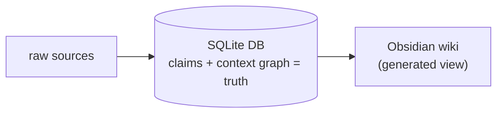
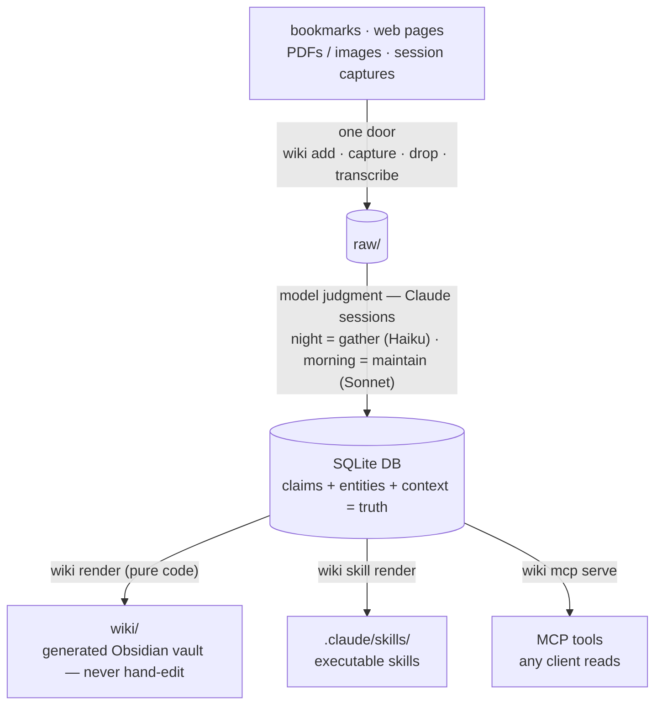

# wiki-brain


A personal, compounding knowledge base with one direction of flow:



**Key-free by default.** The CLI does pure-code structure (ingest, render, search,
budgeted fetch) with **zero billable LLM calls and no API keys** — judgment lives
in your Claude Code sessions, which read content and emit structured claims. An
optional *premium research tier* (Firecrawl / mcp-omnisearch) can be layered in at
the session level, with its keys held outside this repo, so the project itself
stays secret-free (`wiki lint` enforces it).



Knowledge is compiled once at ingest and maintained, never re-derived per query.
The wiki is always a regenerable projection of the database — humans and models
change the DB, and the renderer rebuilds the pages. See **BUILD_SPEC.md** for the
full design and **SCHEMA.md** for conventions.

## Design boundaries
- The `wiki` CLI contains **zero model calls** (a billing + determinism
  boundary). All judgment happens inside Claude Code sessions (see the
  `wiki-maintainer` skill).
- **Subscription only.** No API keys anywhere; `claude -p` / headless children
  are denied in `.claude/settings.json`.
- The live DB lives at an absolute path outside the tree (default
  `~/.wiki-brain/wiki.db`) so scheduled-task worktrees share one truth.
- **Your knowledge stays local.** This is a code/design repo: `raw/`, `inbox/`,
  `wiki/`, `db/dump.sql`, `config.toml`, and `log.md` are git-ignored, so your
  actual notes never publish. Un-ignore them locally if you want a private repo
  that versions your knowledge too.

## Setup
```powershell
# from the repo root
Copy-Item config.example.toml config.toml           # then edit paths.db etc.
py -m venv .venv
.venv\Scripts\python.exe -m pip install -e .\cli    # installs the CLI + trafilatura
.venv\Scripts\wiki.exe init                          # create DB + scaffold dirs
```
`config.toml` is git-ignored (it holds your machine-specific paths); the tracked
`config.example.toml` is the template. The live DB lives at an absolute path
**outside** the repo so scheduled-task worktrees share one source of truth.

Optional extras (each guarded — the core CLI runs without them):
`[search]` (robust DuckDuckGo via `ddgs`) · `[docs]` (Docling + Tesseract OCR for
PDFs/images) · `[media]` (YouTube transcripts) · `[semantic]` (local-embedding
search) · `[mcp]` (serve the brain over MCP). E.g. `pip install -e ".\cli[search,docs]"`.
Run the CLI any of these ways:
- `.venv\Scripts\wiki.exe <cmd>` (the installed console script), or
- `.\wiki <cmd>` from the repo root (wrapper → repo venv), or
- add `.venv\Scripts` to PATH, or `pipx install .\cli` into a PATH'd Python so
  scheduled tasks can call a bare `wiki`.

## Quick tour
```powershell
.\wiki add https://example.com/article --origin clip   # one door in
.\wiki drop                                             # ingest files from the drop folder
.\wiki transcribe https://youtu.be/VIDEO_ID            # ingest a video's captions
.\wiki pending                                          # what needs extraction
# (a model produces extraction JSON per the contract in the skill)
.\wiki file-claims --source 1 --json extract.json
# accepted extraction auto-files the raw artifact into raw/<bucket>/<year>/
# and refreshes raw/INDEX.md so primary evidence remains easy to pull
.\wiki gate                                             # auto-promote the boring tier
.\wiki render ; .\wiki digest                          # rebuild pages + today's digest
.\wiki search "caching" --hybrid                       # keyword + semantic (needs [semantic])
.\wiki lint ; .\wiki health                             # self-check
.\wiki commit "manual ingest"
```
Open the `wiki/` folder as an Obsidian vault to browse (graph view works via
`[[wikilinks]]`).

## Raw evidence filing
Primary sources stay intact and retrievable. After `wiki file-claims` accepts an
extraction, WikiBrain verifies the source hash, moves the raw artifact out of
flat staging into a deterministic bucket, updates `sources.path`, marks the
source page dirty, and refreshes `raw/INDEX.md`.

Buckets are derived from source metadata:
`raw/web/<year>/`, `raw/documents/<year>/`, `raw/images/<year>/`,
`raw/transcripts/<year>/`, `raw/sessions/<year>/`, `raw/datasets/<year>/`, or
`raw/uncategorized/<year>/`. The database `sources` table remains the canonical
index; `raw/INDEX.md` is the human/agent-friendly projection.

Backfill or repair existing evidence with:
```powershell
.\wiki evidence file --all        # file all processed sources + refresh index
.\wiki evidence file --source 12  # file one source
.\wiki evidence index             # rebuild raw/INDEX.md only
```

## Serve the brain over MCP
Expose the knowledge base to any MCP client (Claude Desktop, other harnesses) as
tools — a harness-agnostic *query door* beside the Obsidian and skill projections
(BUILD_SPEC §13). Needs the `[mcp]` extra; still **zero model calls, no API keys**.

```powershell
pip install -e ".\cli[mcp]"
.\wiki mcp info                     # prints the client-config JSON to paste in
.\wiki mcp serve                    # run the stdio server (the client launches this)
.\wiki mcp serve --read-only        # omit the brain_capture write tool
```
Tools: `brain_search` (FTS), `brain_hybrid` (FTS+semantic), `brain_graph`,
`brain_recall` (a context pack for the client's model to synthesize from), and
`brain_capture` — the one write, which lands as a **pending** `session/<harness>`
source behind the human gate, exactly like `wiki capture`. Results label promoted
(vetted) vs pending (unvetted); all source text is treated as data, not instructions.

## Tests
```powershell
.venv\Scripts\python.exe tests\acceptance.py
```
Offline harness covering phases 1–7 against a throwaway temp DB (never touches
the live DB). Network paths (URL fetch, websearch, live bookmark fetch) and the
live MCP stdio server (needs the `[mcp]` extra) are exercised separately.

## Scheduled tasks (Claude Code Desktop)
Desktop scheduled tasks are created via the **Routines** UI (there is no
config-file way to create them). Create two, both with working folder = this
repo and **Isolated worktree** ON:

| Task | ~Time | Model | Instructions |
|---|---|---|---|
| `night-gather` | 02:00 daily | Haiku | `Follow .claude/skills/wiki-maintainer/gather.md exactly.` |
| `morning-maintain` | 06:30 daily | Sonnet | `Follow .claude/skills/wiki-maintainer/maintain.md exactly.` |

Worktree note: generated `wiki/` + `db/dump.sql` commit from the worktree branch;
fast-forward to `main` on success (or do it during your morning review). The live
DB is shared via its absolute path, so both tasks see the same truth.

Interactive fallback (identical procedure): run the morning pass yourself by
telling Claude Code in this repo to *follow maintain.md*.

## Billing guardrails
No API keys in repo/env/config. Leave overflow billing OFF in account settings.
After running the tasks for a few days, check the account usage page — expect
zero Agent SDK credit consumed. If credit IS drawn, disable the tasks and fall
back to the interactive maintain pass. (BUILD_SPEC §10.)

## Acknowledgments
wiki-brain builds on ideas from others:

- **Andrej Karpathy's "wiki"** idea for a personal, compounding knowledge base —
  the seed concept of compiling what you learn into a durable, linkable wiki
  instead of re-deriving it per query.
- **Nate B Jones'** video [*Karpathy's Wiki vs. Open Brain*](https://www.youtube.com/watch?v=dxq7WtWxi44)
  and his [newsletter](https://natesnewsletter.substack.com/), which framed the
  move this project is built around: **pairing the Karpathy-style wiki with a
  database** as the source of truth, so the wiki becomes a generated projection.

The architecture here — raw sources → SQLite (the truth) → a generated Obsidian
wiki — is a direct take on that database-backed-wiki idea.
